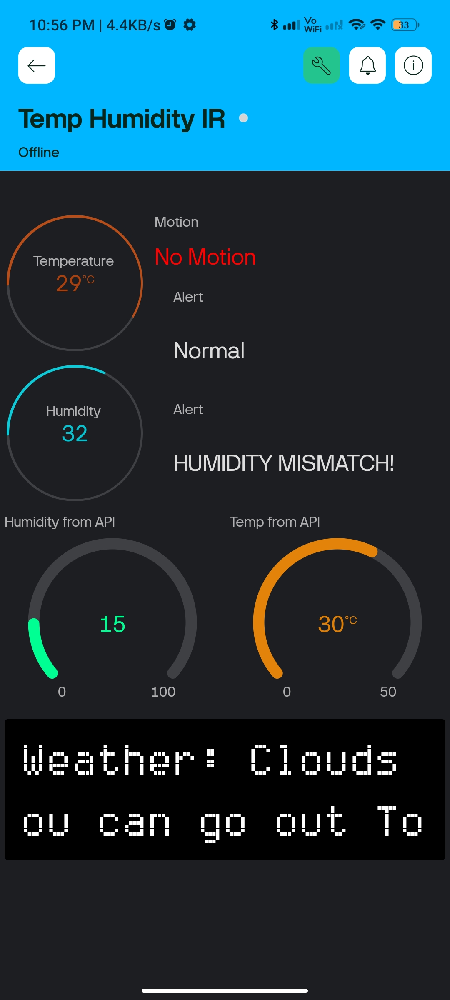
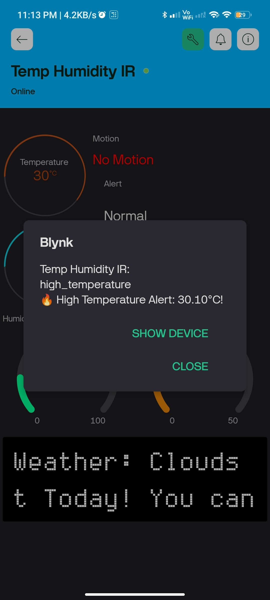

# **Temperature & Motion Monitoring System using ESP8266 & Blynk**

## **Overview**
This project is a Wi-Fi-enabled **temperature, humidity, and motion monitoring system** built using **ESP8266, DHT11, and an IR sensor**. It sends real-time data to the **Blynk app**, where a custom mobile dashboard displays the readings and triggers alerts when thresholds are exceeded. 

## **Features**
- 🌡 **Real-time temperature & humidity monitoring** (DHT11 sensor)
- 🚶‍♂️ **Motion detection alerts** (IR sensor)
- 📲 **Blynk mobile dashboard** for remote monitoring
- 🌍 **Weather API integration** to compare indoor vs. outdoor conditions
- 🔔 **Instant notifications for critical conditions** (e.g., motion detected, temperature too high)
- 🔌 **USB-powered for stable performance**

## **Hardware Components**
- **ESP8266 NodeMCU** – Microcontroller with Wi-Fi support
- **DHT11 Sensor** – Temperature & humidity measurement
- **IR Sensor** – Motion detection
- **3 LEDs (Orange, Yellow, Blue)** – Alert indicators
- **USB Power Supply** – Reliable power source
- **Blynk Mobile App** – Custom dashboard for real-time monitoring

## **Circuit Diagram**


## **Mobile Dashboard & Notifications**
📱 **Blynk Mobile Dashboard:**


🔔 **Example Notifications:**


🎥 **Project Demo Video:**
[Insert Video Link Here](#)

## **Setup & Installation**
### **1. Hardware Setup**
- Connect **DHT11** data pin → D4
- Connect **IR Sensor** output → D8
- Connect **LEDs**: Orange (D3), Yellow (D1), Blue (D2)
- Power ESP8266 using a **USB adapter**

### **2. Software Setup**
- Install **Arduino IDE**
- Install the following libraries:
  ```bash
  BlynkSimpleEsp8266
  ESP8266WiFi
  DHT
  ArduinoJson
  ESP8266HTTPClient
  ```
- Replace **Wi-Fi credentials & Blynk Auth Token** in the code
- Upload the code to ESP8266

## **Working Mechanism**
1. **ESP8266 reads temperature & humidity** from **DHT11** sensor.
2. **IR sensor detects motion** and updates Blynk.
3. **Weather API fetches outdoor conditions** for comparison.
4. **Blynk displays data on the mobile dashboard**.
5. **Alerts & notifications are triggered** if thresholds are exceeded.

## **Practical Applications**
🏠 **Smart Homes** – Indoor climate & security monitoring
🏥 **Healthcare Facilities** – Room temperature & motion tracking
🏢 **Offices & Industries** – Environmental monitoring for comfort & safety
🚜 **Agriculture** – Greenhouse climate monitoring

## **Future Improvements**
- 🔔 **Add a buzzer** for audible alerts
- 🔋 **Optimize for battery-powered operation**
- 🌐 **Expand to control home appliances**

---

### 🚀 **Let's make IoT smarter with Blynk!**
